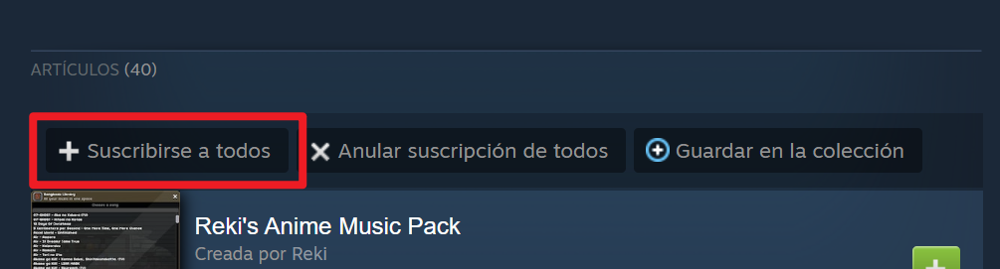
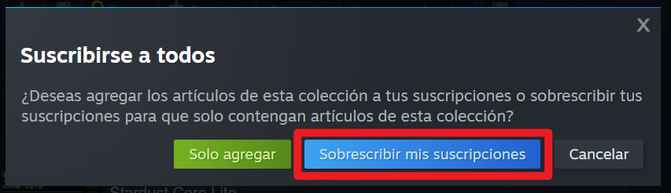
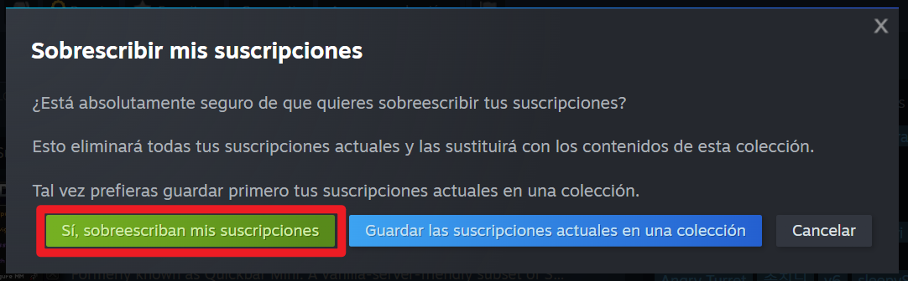

# 29/07/2025 - CompoGalaxy 3.0

1. Entrar a esta página con tu cuenta de Steam:\
   [https://steamcommunity.com/sharedfiles/filedetails/?id=3537094884](https://steamcommunity.com/sharedfiles/filedetails/?id=3537094884)
2.  Dale al botón "Suscribirse" 

    <figure><figcaption></figcaption></figure>
3.  Luego dale al botón "Sobreescibir mis suscripciones" 

    <figure><figcaption></figcaption></figure>

4.  Y por último al botón "Si, sobreescibir mis suscripciones" 

    <figure><figcaption></figcaption></figure>
