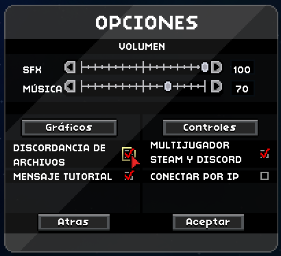
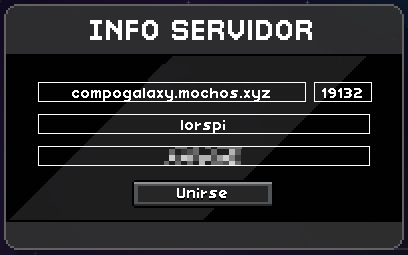
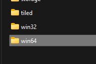
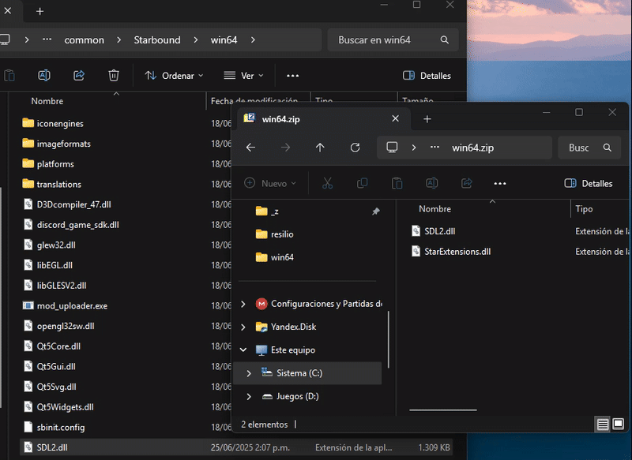
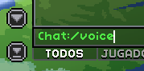
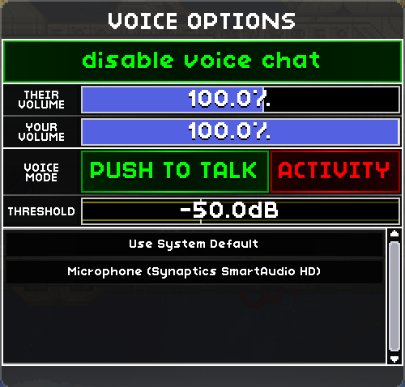
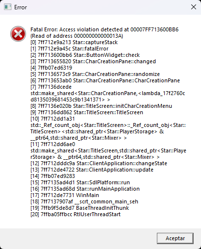

# Ayuda

### Entrar al servidor

Primero hay que hacer una configuración. Ve a Opiones en el menú principal y allí checkea la opción que dice _"Discordancia de archivos"_ 

<figure><figcaption></figcaption></figure>


Al crear tu personaje no omitas la misión de inicio que es la que te enseña las mecánicas básicas.


Una vez hecho esto ya estás list@ para entrar al servidor. En el menú principal ve a _"Unirse a juego"_, selecciona/crea tu personaje y en la pantalla info servidor vas a poner los siguientes datos:\
\
**Dirección ip:** compogalaxy.mochos.xyz\
**Puerto:** 19132\
**Cuenta servidor:** <mark style="color:blue;">Tu usuario del servidor</mark>\
**Contraseña:** <mark style="color:blue;">Tu contraseña del servidor</mark>


Si no tienes usuario y contraseña pideselo a **lorspi**, o **PantallazoAzul**.


<figure><figcaption></figcaption></figure>

### Extensión para chat de voz

1. Descarga [este archivo](https://github.com/StarExtensions/StarExtensions/releases/download/1.9.26/win64.zip).
2.  Ve a steam y en Starbound dale clic derecho, Administrar y Ver archivos locales 

    <figure><figcaption></figcaption></figure>
3.  Entra en la carpeta _"win64"_ 

    <figure><figcaption></figcaption></figure>
4.  Extrae todo el contenido del zip descargado en esta carpeta _"win64"_. &#x20;

    <figure><figcaption></figcaption></figure>
5.  Dentro del juego escribe _"/voice"_ en el chat para abrir la ventana de configuración de voz. 

    <figure><figcaption></figcaption></figure>

    <figure><figcaption></figcaption></figure>

### Problemas comunes

#### El juego crashea al abrirlo

Es muy común. Normalmente se soluciona al volver a abrir el juego.
