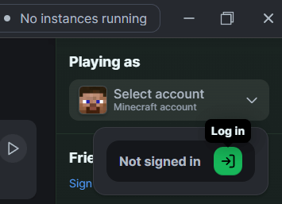
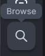
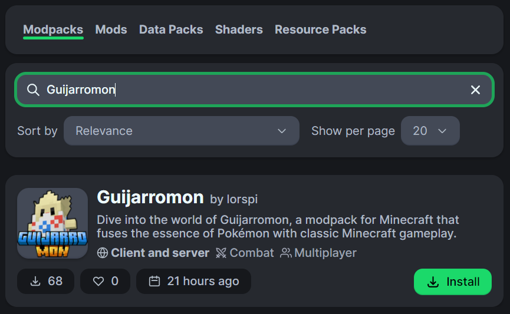
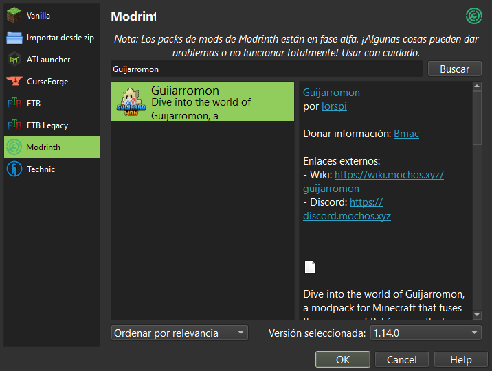

# 🙋 ¡Bienvenid@ a Guijarromon!


Esta temporada de Guijarromon ha finalizado.



### 🔗 Enlaces de interés

Mapa del mundo: [mochos.xyz/guijarromon/mapa](https://mochos.xyz/guijarromon/mapa)\
Showcase de Pokémons: [mochos.xyz/guijarromon/showcase](https://mochos.xyz/guijarromon/showcase)\
Discord de Team Mochos: [discord.mochos.xyz](https://discord.mochos.xyz)

Sumérgete en el mundo de Guijarromon, un modpack para Minecraft que fusiona la esencia de Pokémon con la jugabilidad clásica de Minecraft. Este modpack te permite capturar, entrenar y luchar con más de 600 criaturas inspiradas en Pokémon, ofreciendo una experiencia única y emocionante.


[](https://ko-fi.com/Q5Q71E7D8X)

### 🎮 ¿Cómo jugar?

Para entrar en Guijarromon debes haber sido invitado por uno de los pioneros y seguir las instrucciones a continuación según si eres premium o no. Solicita a la persona que te invitó que te de acceso.



<figure><figcaption></figcaption></figure>



### Instala Modrinth

[Descarga desde la web oficial](https://modrinth.com/app)



### Inicia sesión

En la parte superior derecha de la ventana inicia sesión en tu cuenta Microsoft.

<div align="left"><figure><figcaption></figcaption></figure></div>





### En la ventana principal dale en la lupa





### Busca "Guijarromon" y dale "Install"





### Ejecuta la instancia y agrega esta IP en "Multiplayer"

```
guijarromon.mochos.xyz
```





<figure><figcaption></figcaption></figure>


Es indispensable que tengas Java instalado. Versión recomendada: 21. Descárgalo de [este enlace](https://www.oracle.com/java/technologies/downloads/#java21).




### Instala PolyMC

[Descarga desde la web oficial](https://polymc.org/download/)



### Si es primera vez que abres el Launcher debes configurar el Java y agregar tu nombre de usuario

<details>

<summary>Configurar java</summary>

En la primera ejecución te preguntará sobre el ejecutable de Java. Debes seleccionar la versión recomendada y asignarle suficiente memoria:


</details>

<details>

<summary>Establecer nombre de usuario</summary>

En la ventana principal del launcher en la parte superior derecha dale clic a "Perfiles" y luego a "Gestionar cuentas...".


Luego dale clic a "Agregar cuenta sin conexión" y en la ventana que se abre agrega tu nombre de usuario con el que entrarás al servidor.


Dale "Ok", cierra esa ventana y ya está configurado.


</details>



### En la ventana principal dale en "Añadir instancia"





### Dale a la opción "Modrinth", busca "Guijarromon" y dale "OK"







### Ejecuta la instancia y agrega esta IP en "Multiplayer"

```
guijarromon.mochos.xyz
```





Puedes descargar manualmente el modpack desde el siguiente enlace:\
[https://modrinth.com/modpack/guijarromon](https://modrinth.com/modpack/guijarromon)

#### Modrinth

Para instalar esta descarga en Modrinth, debes hacer doble clic en el archivo descargado.

#### PolyMC

Para instalar esta descarga en PolyMC/MultiMC, debes arrastras el archivo descargado a la ventana principal del launcher.

#### Otros launchers <mark style="color:red;">(No recomendado)</mark>


Esta opción no instala las configuraciones óptimas de estética y rendimiento. <mark style="color:red;">**UTILIZA ESTA OPCIÓN BAJO TU RESPONSABILIDAD**</mark>


Para instalar los mods en otros launchers, debes acceder a la [última versión](https://modrinth.com/modpack/guijarromon/version/latest) del modpack y descargar cada contenido manualmente. <mark style="color:red;">**Debes tener en cuenta que necesitas la versión exacta de cada mod que utiliza el modpack.**</mark>



Si algo no funciona bien o sale algún error inesperado, consulta la [sección de ayuda](informacion/ayuda.md).
