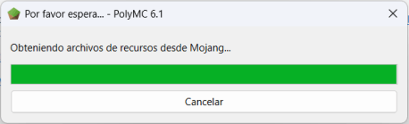
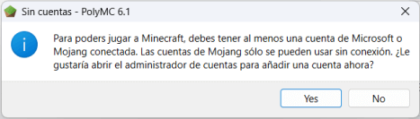
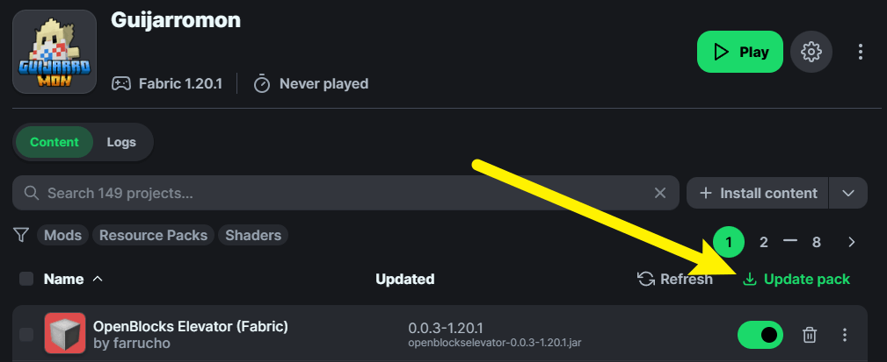
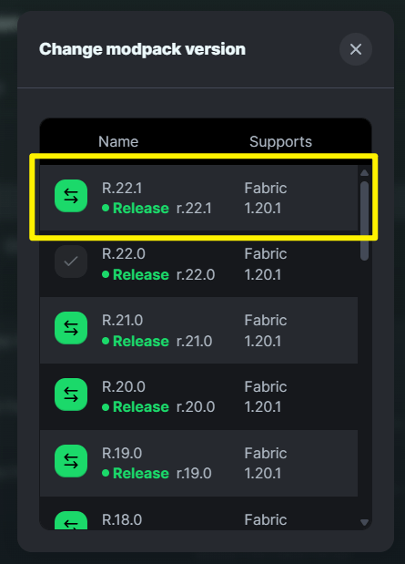
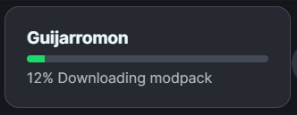
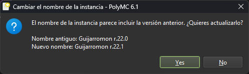

# 🆘 Ayuda

### Problemas comunes

| Problema                                                                                                                                                                                                                                                               | Solución                                                                                                                                                                                                                                                                    |
| ---------------------------------------------------------------------------------------------------------------------------------------------------------------------------------------------------------------------------------------------------------------------- | --------------------------------------------------------------------------------------------------------------------------------------------------------------------------------------------------------------------------------------------------------------------------- |
| 
Crashea con este error en consola: <code>Minecraft 1.18 Pre Release 2 and above require the use of Java 17</code>
                                                                                                                                            | Actualiza tu instalación de Java a la versión 21. Descarga el instalador [en este enlace](https://www.oracle.com/java/technologies/downloads/#java21). El que dice "**x64 Installer**". Luego configura la ruta de acceso de Java en el launcher con esta nueva versión.    |
| 
Al tratar de entrar al servidor te bloquea con el mensaje: <code>You are not whitelisted on this server!</code>
                                                                                                                                              | Si fuiste invitado al servidor y te sale esto, contacta a algún admin o streamer de Guijarromon o a la persona que te invitó. Si no sabes a quién contactar, es la razón por la que no fuiste invitado. :v                                                                  |
| `El proceso se cerró con el código 1.`                                                                                                                                                                                                                                 | Probablemente tu hardware no aguanta el modpack :cry:                                                                                                                                                                                                                       |
| 

PolyMC / MultiMC se queda obteniendo recursos desde Mojang y no avanza.
                                                                                                | Cancela, cierra el launcher y vuelve a iniciar.                                                                                                                                                                                                                             |
| 

En PolyMC / MultiMC al tratar de ejecutar la instancia te sale este mensaje.
                                                                                                                             | Dale "Yes" y en el administrador de cuentas entra a "Agregar cuenta sin conexión". Ahí pones el nombre de usuario con el que vas a entrar al Servidor                                                                                                                       |
| En PolyMC / MultiMC al instalar el modpack no contiene ningún mod. Cuando esto pasa a veces tampoco carga el icono de Guijarromon en la instancia.                                                                                                                     | A veces suceden errores de descarga del modpack. Debes borrar la instancia y volver a instalarla. Sabrás que ha descargado correctamente si ves el icono de Guijarromon en la instancia y al abrirlo te carga una pantalla de inicio personalizada del modpack.             |
| 
Te saca del servidor con un mensaje que empieza mas o menos así: <code>Conexión perdida</code>

<code>Received 2 registry entries that are unknoun to this client. This is usually caused by a mismatched mod set between the client and server.</code>
 | 
Esto es porque actualizaste mods del servidor en tu cliente. Las versiones de los mods deben coincidir exactamente. De lo contrario, te expulsa inmediatamente al entrar.  La solución es sencilla: Restaura los mods que actualizaste o reinstala el modpack.
 |

### ¿Cómo ocultar contraseña en stream?

El modpack incluye un mod de macros al que le puedes asignar comandos. Para evitar que tu `/login` se vea en stream configura un macro para ejecutar el comando de la siguiente forma:

1. Busca en la configuración de controles esta configuración y asígnale una tecla.

2. Con esa tecla asignada abres la configuración de macros. En esta pantalla dale al botón "Add Macro"

3. Luego despliega el macro que acabas de crear y pone tu comando `/login <contraseña>`, asígnale una tecla y dale "Save & Exit"

4. Cuando entres al servidor solo presionas la tecla asignada al macro y este comando se ejecutará en silencio. Si ya expusiste tu contraseña, usa el comando `/changepass <antigua contraseña> <nueva contraseña>` para cambiarla.

### Actualizar modpack



<figure><figcaption></figcaption></figure>


Antes de actualizar recuerda respaldar los siguientes archivos de la carpeta `.minecraft` de la instancia:

* `options.txt`: Guarda todas las configuraciones del juego incluyendo las asignaciones de teclas.
* Carpeta `config/`: Guarda las configuraciones específicas de cada mod.
* Carpetas `XaeroWaypoints` y `XaeroWorldMap`: Guardan toda la exploración que has hecho en el mapa y tus waypoints.


La actualización se hace de forma automática en el launcher. Si por algún motivo esto falla, verifica que la versión del modpack que tienes es la última disponible de la siguiente forma:



### Busca actualizaciones

Entra en la instancia y dale al botón "Update pack" en la parte superior derecha de la lista de mods. Si no existe este boton, dale en "Refresh" para verificar actualizaciones.

<figure><figcaption></figcaption></figure>




### Selecciona la release más reciente

Dale clic en el icono verde de la release más reciente que te aparezca en la lista.

<figure><figcaption></figcaption></figure>



### Espera

Espera a que se termine de actualizar y listo.

<figure><figcaption></figcaption></figure>






<figure><figcaption></figcaption></figure>


Antes de actualizar recuerda respaldar los siguientes archivos de la carpeta `.minecraft` de la instancia:

* `options.txt`: Guarda todas las configuraciones del juego incluyendo las asignaciones de teclas.
* Carpeta `config/`: Guarda las configuraciones específicas de cada mod.
* Carpetas `XaeroWaypoints` y `XaeroWorldMap`: Guardan toda la exploración que has hecho en el mapa y tus waypoints.




### En la ventana principal dale en "Añadir instancia"




### Dale a la opción "Modrinth", busca "Guijarromon" y dale "OK"




### Actualizar instancia existente

El detectar que ya existe una instancia del modpack te va a preguntar lo siguiente a lo cual debes darle a la opción "Actualizar la instancia existente" y espera a que se termine de actualizar.

<figure><figcaption></figcaption></figure>



### Espera y renombra

Al terminar la actualización te preguntará si deseas renombrar. Dale que si para que sepas en que versión estás.

<figure><figcaption></figcaption></figure>




### Recupera tus configuraciones

Pega nuevamente en la carpeta `.minecraft` de la instancia las configuraciones que respaldaste.





