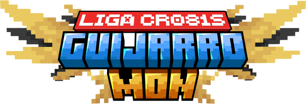

# 🏆 Liga Guijarromon

<figure><figcaption></figcaption></figure>

## Fases del juego

### Fase de preparación (3 semanas)

Los entrenadores tienen el tiempo para explorar el mundo y prepararse para la liga.\
Los líderes de gimnasio tienen el tiempo para preparar su gimnasio, conseguir sus pokemons y ganarse la licencia de gimnasio.

### Liga Pokémon (6 semanas)

Cuando empiece la Liga Pokémon, los entrenadores pueden empezar a desafiar a los líderes de gimnasio.

**Enfrentamientos oficiales**\
Cada líder de gimnasio recibirá las solicitudes de enfrentamiento de los líderes y los debe coordinar para la siguiente ronda de enfrentamientos programada o para algún momento en el que puedan estar presentes los dos contrincantes y al menos un miembro de la administración. \
\
Cada ronda de enfrentamientos contará con dos fases: La primera fase en la que iremos recorriendo cada gimnasio para hacer los enfrentamientos programados. La segunda fase para darle oportunidad a los entrenadores que no consiguieron medalla en la primera fase y aquellos que no se programaron para la ronda de enfrentamientos. Los que no obtengan medalla en esta segunda fase pueden programarse para la siguiente ronda de enfrentamientos.


Las fechas de las rondas de enfrentamientos serán establecidas por votación en Discord.


Sólo los enfrentamientos certificados por la administración podrán entregar medallas. Las medallas se son personales e intransferibles. Cada entrenador puede obtener varias medallas de un gimnasio pero para participar en la liga de campeones sólo será válida una medalla de cada gimnasio.

**Niveles de los gimnasios**\
En la sala de información se mostrará la información actualizada del nivel de cada gimnasio para que los entrenadores estén al tanto del nivel requerido en cada uno.

### Torneo de campeones (1 evento por programar)

Habrán dos torneos de campeones: Uno para todos los entrenadores que hayan ganado las medallas de todos los gimnasios y uno para los líderes de gimnasio.\
\
En los últimos días de la liga se abrirán las inscripciones para estos dos torneos. Cuando haya la suficiente cantidad de inscritos, se planea en conjunto por Discord la fecha y la hora del evento.

Los participantes de estos eventos pueden utilizar los pokémon que quieran sin restricciones de tipo o de nivel. Antes de cada enfrentamiento deben presentar a su equipo completo ante el público y su oponente.

## Líderes de gimnasio

El Líder de Gimnasio es un entrenador excepcional y carismático que desafía a los jugadores a demostrar sus habilidades en batallas Pokémon. Este personaje no solo es un experto en estrategias de combate, sino que también actúa como mentor y guía para los aspirantes a entrenadores. Con un equipo de Pokémon bien entrenado y un estilo único, el Líder de Gimnasio ofrece batallas emocionantes que ponen a prueba la destreza y el conocimiento de los jugadores sobre el mundo de Cobblemon.

#### Características clave:

* Gran conocimiento sobre Pokémon y sus habilidades.
* Habilidades de liderazgo y comunicación.
* Pasión por el juego y la enseñanza.

#### Requisitos para obtener licencia de líder de gimnasio:

* Tener gimnasio en condiciones con arena, gradería, PC, Máquina de curación.
* Temática definida por tipo de pokémon o concepto definido.
* Elegir medalla entre las disponibles.

#### Ayudas del administración:

Al ser un cargo dispendioso y de alta responsabilidad, un líder de gimnasio puede recibir ayudas de la administración del servidor para agilizar sus tareas.

* Ayuda en la construcción del gimnasio: Se le proveen los materiales necesarios o se importa el gimnasio construido desde su mundo creativo.
* Instalación de Sharestone roja para que los entrenadores puedan llegar fácilmente desde el spawn.

#### Responsabilidades:

*   Organizar y llevar a cabo batallas en el gimnasio. Cada líder tiene la libertad de diseñar los desafíos en su gimnasio que pueden variar entre resolver laberinto, parkour, enfrentar otros entrenadores antes del líder, etc. Estos desafíos deben ser aprobados por la administración para garantizar el equilibrio y el juego justo. No se permiten desafíos que consistan en pagar o entregar algún objeto.

    

Todas los desafíos para otorgar medallas deben ser transmitidos o grabados. El líder del gimnasio no necesita hacerlo por si mismo. Puede pedirle a un streamer que transmita el evento o a algun amigo que lo grabe.

* Proporcionar consejos y estrategias a los jugadores.
* Promover la comunidad y fomentar la competencia amistosa.
* Mantener un ambiente acogedor y desafiante para todos los entrenadores.
* Construir y administrar su gimnasio, asegurando que esté bien diseñado, decorado, funcional y accesible para los entrenadores.
* Otorgar medallas del gimnasio a los entrenadores que le ganen en batallas oficiales, reconociendo así su habilidad y esfuerzo.

## Entrenadores

**Características clave:**

* **Competidor**: Este entrenador compite activamente con otros entrenadores para subir los niveles de sus Pokémon, buscando siempre mejorar su equipo y habilidades en combate.
* **Capturador y Entrenador**: Se dedica a capturar y entrenar Pokémon salvajes, aprovechando cada oportunidad para fortalecer su equipo y aprender nuevas estrategias.
* **Gimnasios y Medallas**: Participa en competiciones en gimnasios, donde puede ganar múltiples medallas. Sin embargo, para el torneo de campeones, solo puede utilizar una medalla de cada gimnasio, ya que estas son personales e intransferibles.

#### Requisitos para participar en la liga pokémon

* Tener al menos 6 pokemons para desafiar a un lider de gimnasio.

#### Requisitos para participar en el torneo de campeones

* Haber ganado al menos 8 medallas. Cada medalla va marcada con el nombre de su portador. Presentar medallas con otro nombre se considera fraude.

## Survival casual / Comerciantes, proveedores, exploradores y otros

Todos aquellos jugadores que no tengan intensiones de participar en la mecánica de la liga pokémon también son bienvenidos. Pueden desarrollar su historia dentro del servidor libremente.  Adicionalmente podrían ser de apoyo a entrenadores y líderes de diferentes formas:

* Comerciar objetos que sean de utilidad para ellos. Ya sea directamente o con [Shopkeepers](comandos.md#shopkeepers).
* Ayudarles en la construcción, exploración, búsqueda, etc.
* Simplemente siendo compañía en sus aventuras.

 
