# 👾 Mecánicas propias

Esta es una lista de objetos y funcionalidades creadas exclusivamente para Guijarromon.

### Objetos especiales

Estos objetos se consiguen en la tienda del spawn.

<table data-header-hidden><thead><tr><th width="193"></th><th></th></tr></thead><tbody><tr><td> 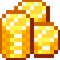     </td><td>
<strong>Ceitiles</strong>

Es la moneda de Guijarromon. Con esta moneda se hacen los intercambios económicos con NPCs y entre jugadores.
</td></tr><tr><td> 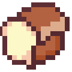 </td><td><strong>Pan de masa madre de</strong> <a href="https://www.instagram.com/migluten"><strong>@MiGluten</strong></a> Una barra de pan saludable que concede efectos de regeneración 2, absorción 2 y resistencia 2.  Si quieres aprender a prepararlo por tu cuenta, pídele a elPantallazoAzul la receta.</td></tr><tr><td> 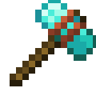     </td><td><strong>Instaminador</strong> Rompe un radio de 3x3 bloques. No reparable - No encantable.</td></tr><tr><td> 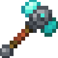     </td><td><strong>Instaminador II</strong> Más eficiente que el anterior</td></tr><tr><td> 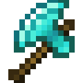     </td><td>
<strong>Brisa Tempestuosa</strong> Infringe más daño al atacar en caída. Evita el daño por caída desde alturas no letales.

Úsala para impulsarte hacia arriba. No reparable - No encantable.
</td></tr><tr><td> 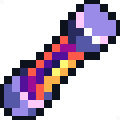 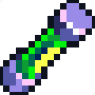     </td><td><strong>Inyecciones de salud y experiencia</strong> Al usarlas te cargan 5 corazones de salud o 15 niveles de experiencia respectivamente. Aplica la inyección de salud a un compañero caído para revivirlo.</td></tr><tr><td>  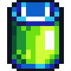  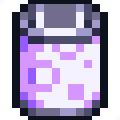     </td><td><strong>Cartucho de experiencia</strong> Usa un cartucho de experiencia vacío para guardar 30 niveles.  Usa uno lleno para cargar 30 niveles.</td></tr><tr><td>  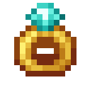 </td><td><strong>Anillo de compromiso</strong> Úsalo para casarte con tu pareja y obtener <a href="mecanicas-propias.md#matrimonio">beneficios especiales</a>. </td></tr><tr><td> 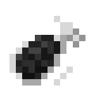 </td><td><strong>Carga explosiva</strong> Al impactar produce una explosión de aire que empuja a todas las criaturas cercanas.</td></tr></tbody></table>

### Matrimonio

Te puedes casar con otro jugador para obtener algunos beneficios:

* Mientras estés cerca de tu pareja ambos obtienen constantemente regeneración, prisa minera y fuerza..
* Tienen acceso a comandos especiales para parejas que brindan funcionalidades exclusivas.
  * `/mtr` Muestra la ayuda.
  * `/mtr chat` Activas / desactivas el chat privado con tu pareja.
  * `/mtr tp` Teleportarte a ti mismo hacia tu pareja.
  * `/mtr tp-si` Activa el permiso a tu pareja de teleportarse hacia ti.
  * `/mtr tp-no` Niega el permiso a tu pareja de teleportarse hacia ti.
  * `/mtr enviar` Envía a tu pareja los objetos que tengas en tu mano.
  * `/mtr pvp` Activas / desactivas el pvp con tu pareja.

Para casarse deben tener cada uno una Gema de compromiso que se consigue en la tienda del spawn. Para la ceremonia necesitan preparar un lugar especial y buscar un cura para que celebre la unión oficialmente.
