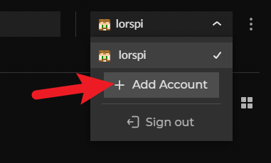
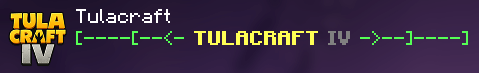
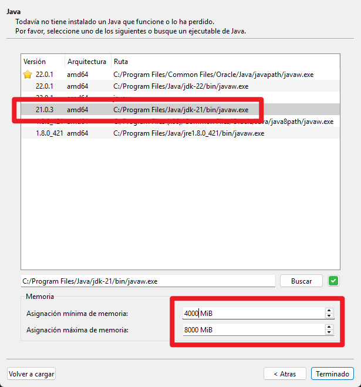
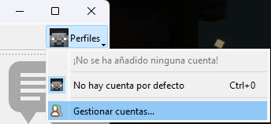
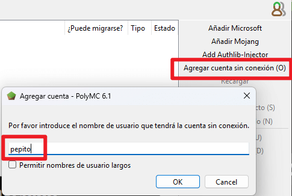

# 🙋 ¡Bienvenid@ a Tulacraft!


Esta temporada de Tulacraft ha finalizado.


### Lore del multiverso de Tulacraft

Conoce todo el contexto de Tulacraft y otros universos conectados al vacío:


[historias-del-vacio](historias-del-vacio/)


### 🎮 ¿Cómo jugar?

Para entrar en Tulacraft debes haber sido invitado por uno de los creadores o miembros antiguos, unirte al [Discord de Horizon Games](https://discord.gg/sg4PYdUPKQ) para solicitar ser agregado a la lista blanca y seguir las instrucciones a continuación según si eres premium o no.



<figure><figcaption></figcaption></figure>



### Instala CurseForge

[Descarga desde la web oficial](https://www.curseforge.com/download/app)



### Inicia sesión

En la parte superior derecha de la ventana inicia sesión en tu cuenta Microsoft.

<figure><figcaption></figcaption></figure>




### En la ventana principal dale clic a Minecraft

<figure><figcaption></figcaption></figure>




### Busca "Tulacraft" y dale "Install"

<figure><figcaption></figcaption></figure>



### Al darle "Play" se abrirá el launcher de Mojang en el cual debes iniciar sesión y luego darle a "Jugar"

<figure><figcaption></figcaption></figure>




### Ejecuta la instancia ve a "Multiplayer" y entra en el servidor "Tulacraft"

<figure><figcaption></figcaption></figure>


La primera vez que entres en el servdior debes registrarte. [Click aquí](informacion/comandos/#seguridad) para obtener ayuda.

Si el servidor no aparece debes agregarlo con la ip: `tula.mochos.xyz`






<figure><figcaption></figcaption></figure>


Es indispensable que tengas Java instalado. Versión recomendada: 21. Descárgalo de [este enlace](https://www.oracle.com/java/technologies/downloads/#java21).




### Instala PolyMC

[Descarga desde la web oficial](https://polymc.org/download/)



### Si es primera vez que abres el Launcher debes configurar el Java y agregar tu nombre de usuario

Configurar java

En la primera ejecución te preguntará sobre el ejecutable de Java. Debes seleccionar la versión recomendada y asignarle suficiente memoria:

Establecer nombre de usuario

En la ventana principal del launcher en la parte superior derecha dale clic a "Perfiles" y luego a "Gestionar cuentas...".

Luego dale clic a "Agregar cuenta sin conexión" y en la ventana que se abre agrega tu nombre de usuario con el que entrarás al servidor.

Dale "Ok", cierra esa ventana y ya está configurado.




### En la ventana principal dale en "Añadir instancia"




### Dale a la opción "CurseForge", busca "Tulacraft" y dale "OK"

.png>)




### Ejecuta la instancia ve a "Multiplayer" y entra en el servidor "Tulacraft"

<figure><figcaption></figcaption></figure>


La primera vez que entres en el servdor debes registrarte. [Click aquí](informacion/comandos/#seguridad) para obtener ayuda.

Si el servidor no aparece debes agregarlo con la ip: `tula.mochos.xyz`






Puedes descargar manualmente el modpack desde el siguiente enlace y elegir la versión mas reciente darle click y luego darle click a "Download" en la parte superior derecha:\
[https://www.curseforge.com/minecraft/modpacks/tulacraft-iv/files](https://www.curseforge.com/minecraft/modpacks/tulacraft-iv/files)

<figure><figcaption></figcaption></figure>

<figure><figcaption></figcaption></figure>

#### CurseForge

Para instalar esta descarga en CurseForge, debes entrar en las instancias de Minecraft y darle al botón "Import". En la ventana que se abre debes darle a la opción "Choose .zip file" y seleccionas el zip descargado.\
.png>).png>)

#### PolyMC

Para instalar esta descarga en PolyMC/MultiMC, debes arrastrar el archivo descargado a la ventana principal del launcher.

#### Otros launchers <mark style="color:red;">(No recomendado)</mark>


Esta opción no instala las configuraciones óptimas de estética y rendimiento. <mark style="color:red;">**UTILIZA ESTA OPCIÓN BAJO TU RESPONSABILIDAD**</mark>


Para instalar los mods en otros launchers, debes acceder a la [última versión](https://www.curseforge.com/minecraft/modpacks/tulacraft-iv/files) del modpack y descargar cada contenido manualmente. <mark style="color:red;">**Debes tener en cuenta que necesitas la versión exacta de cada mod que utiliza el modpack.**</mark>



Si algo no funciona bien o sale algún error inesperado, consulta la [sección de ayuda](informacion/ayuda.md).

### 🚀 Launchers recomendados

<table data-card-size="large" data-view="cards"><thead><tr><th></th><th></th><th></th><th data-hidden data-card-cover data-type="files"></th></tr></thead><tbody><tr><td><h4>PolyMC</h4></td><td>
Launcher para jugadores premium y no premium

 <a href="https://polymc.org/download/" target="_blank">⬇️ Descarga oficial</a>
</td><td></td><td><a href=".gitbook/assets/polymc.png">polymc.png</a></td></tr><tr><td><h4>CurseForge</h4></td><td>
Sólo para jugadores premium

 <a href="https://www.curseforge.com/download/app" target="_blank">⬇️ Descarga oficial</a>
</td><td></td><td><a href=".gitbook/assets/curseforge.png">curseforge.png</a></td></tr></tbody></table>
