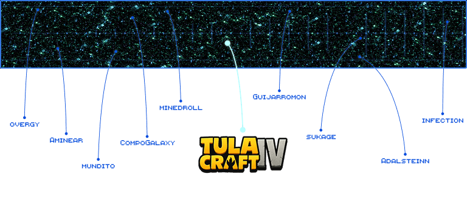
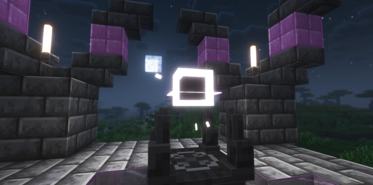
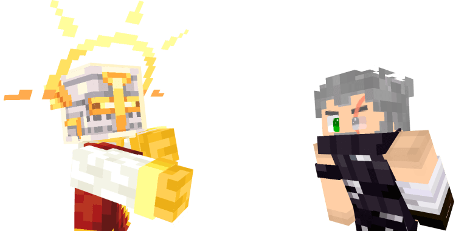

# 📚 Historias del Vacío

### El Multiverso: infinitas realidades

<figure><figcaption></figcaption></figure>

* El multiverso es un conjunto de múltiples universos coexistentes. Cada “realidad” es una versión del cosmos con sus propias reglas, leyes físicas, historias y habitantes.
* Algunas realidades están alineadas (similares entre sí), otras totalmente dispares.
* Los “caminos” o “puertas” entre universos permiten el tránsito: portales, brechas, entidades especiales o tecnología ancestral pueden permitir moverse entre realidades.

### El Vacío (o “La Nada”)

* El Vacío es un plano entre realidades. No es un universo en sí mismo, sino un espacio de transición, de caos o de ausencia.
* Se dice que en el Vacío las leyes físicas se debilitan o desaparecen: el tiempo puede no tener sentido, la materia puede desintegrarse, y la propia identidad estar en juego.
* Viajar por el Vacío es peligroso: muchas entidades o viajeros se pierden, se desvanecen o se “remanifiestan” de forma distinta.

### El Nexo

<figure><figcaption></figcaption></figure>

En medio del caos del Vacío existe un punto de anclaje estable: **el Nexo**.

* Es un portal primordial, creado por fuerzas ancestrales para unir los universos.
* Sin embargo, por defecto está inactivo.
* Para abrir un camino hacia otra realidad, el Nexo necesita una **Llave del Vacío**.

Cada llave está sintonizada con un universo específico. Insertar una llave en el Nexo lo conecta directamente con ese mundo, creando un corredor seguro a través del Vacío.

### La Llave del Vacío

La **Llave del Vacío** no es un objeto común, sino un artefacto forjado con fragmentos del mismo Vacío.

* Solo existen unas pocas llaves, cada una única.
* Funcionan como coordenadas vivientes que permiten al Nexo anclar un universo concreto.
* Recuperarlas o crearlas es una tarea casi imposible, ya que requieren un equilibrio entre energía de un universo y esencia del Vacío.

### Origen y conflicto

* Se engendró un conflicto primordial entre fuerzas que desean el control del multiverso: unas quieren unir las realidades bajo un solo dominio; otras promueven la libertad caótica entre universos.
* Algunas razas o entidades poseen conocimiento del Vacío y usan su poder para abrir (o cerrar) portales, manipular realidades o extraer energía del multiverso.

### Los Guardianes / Equilibrio

<figure><figcaption></figcaption></figure>

* En muchos mitos, hay guardianes del equilibrio que vigilan que ninguna realidad colapse sobre otra, o que el Vacío no corrompa todas las realidades.
* Estos guardianes pueden residir en puntos clave del multiverso, en fortalezas ocultas en los intermundos o en vórtices dimensionales.

### Temas importantes para los jugadores nuevos

* **Fragilidad de la realidad**: lo que parece sólido puede no serlo; una decisión en un universo puede tener eco en otro.
* **Identidad mutable**: viajar puede cambiar la esencia del personaje, dotarlo de poderes extraños, desbalancear su ser original.
* **Poder vs. corrupción**: cuanto más profundo incursiona uno en el Vacío o manipula realidades, más riesgo de corrupción o locura.
* **Alianzas multidimensionales**: personajes o facciones de diferentes universos pueden ser aliados o antagonistas.
* **Exploración y descubrimiento**: cada universo puede tener su magia, reglas, seres únicos y misterios ocultos.

### Historias


[historias-del-vacio/el-eco-del-portal.md](historias-del-vacio/el-eco-del-portal.md)



[historias-del-vacio/el-despertar.md](historias-del-vacio/el-despertar.md)



[historias-del-vacio/el-renacer.md](historias-del-vacio/el-renacer.md)



[historias-del-vacio/el-legado.md](historias-del-vacio/el-legado.md)



[historias-del-vacio/el-llamado-del-nexo.md](historias-del-vacio/el-llamado-del-nexo.md)

