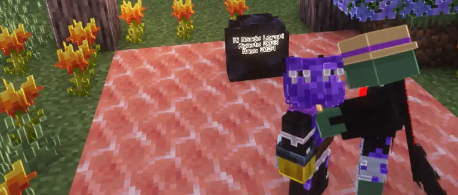

# 📙 El eco del portal

La muerte de lorspi fue un suceso que nadie pudo comprender.\
Cayó sin explicación alguna, y su cuerpo —contrario a lo que ocurre con los que parten— no se desvaneció en partículas de vacío.\
Simplemente… permaneció allí. Inmóvil. Silente.

<figure><figcaption></figcaption></figure>

Su esposa, **LaPetitxd**, lo veló en un pequeño funeral junto a su amigo **iPeteR\_**. Ambos lloraron frente al cuerpo inerte, sin sospechar que aquel suceso marcaría el inicio de una nueva fractura entre los mundos.

Pasaron los días, y el cuerpo desapareció.\
Solo quedaron sus prendas, cuidadosamente dobladas donde había caído.

Fue entonces cuando comenzaron a llegar los mensajes.\
Notas anónimas, escritas con tinta oscura, aparecían dentro de la casa de LaPetitxd.\
Las palabras parecían dictadas por una voz más allá del tiempo:

> “Tu esposo no ha muerto.\
> Vive, pero en otro universo.\
> Si deseas hallarlo, construye el portal.\
> Cruza sosteniendo algo que le haya pertenecido.”

Con el corazón dividido entre el miedo y la esperanza, LaPetitxd siguió las instrucciones.\
Erigió un portal de forma inusual, distinto a cualquier otro conocido.\
Tomó en sus manos las pertenencias de su amado y, antes de dar el paso final, **lo vio**.

A lo lejos, entre la bruma del atardecer, se alzaba **un anciano de cabello canoso**, observándola en silencio.\
Sus ojos brillaban con un fulgor tenue, como si conocieran los secretos del Vacío.\
Por un instante, LaPetitxd sintió que aquel hombre era el autor de las notas…\
Pero antes de que pudiera decir algo, **el anciano desapareció**, desvaneciéndose con el viento.

Respiró hondo, contuvo las lágrimas y dio un paso hacia lo desconocido.\
LaPetitxd cruzó el umbral, siendo envuelta por una luz que parecía devorar el aire mismo.\
El eco de su nombre se deshizo entre los destellos del portal, como si el mundo la llamara por última vez.

El portal **no se cerró**.\
Quedó abierto, pulsando con una energía desconocida.\
Y el mundo comenzó a pudrirse desde sus raíces: la **corrupción skulk** se extendía como un cáncer. 

Desesperados, los habitantes creyeron que el portal era la salvación y se lanzaron hacia él, buscando escapar de la descomposición de su realidad.
