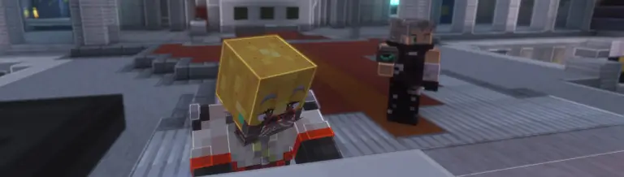
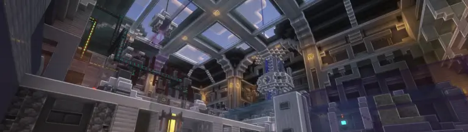
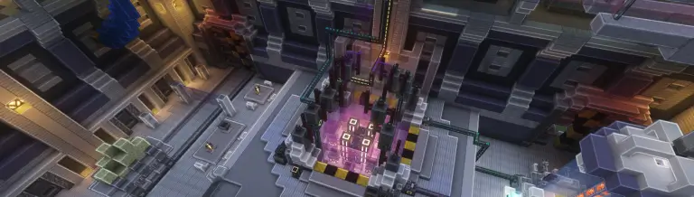
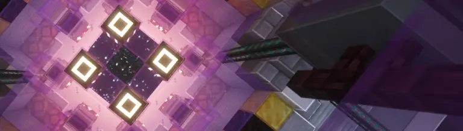
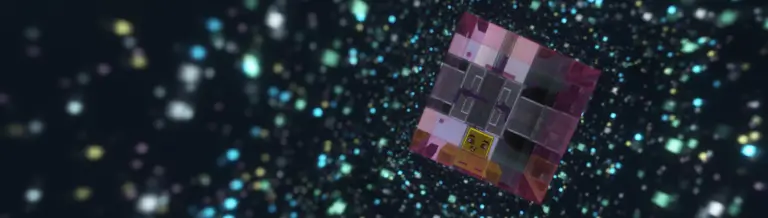
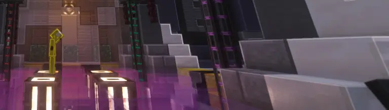

# 📘 El Legado

El0tito es nativo de **Mundito 3**, donde fundó y rigió como alcalde de un pueblo llamado **El0town**.\
\
Tras un evento misterioso, **El0tito** fue trasladado al universo de **Guijarromon**, donde despertó una inesperada pasión por los Pokemones de dicho universo. Junto al Lucario Lukas Pirukas, se convirtió en líder del gimnasio Mano de Piedra, una institución importante en este nuevo universo. También fue cofundador del grupo empresarial LaFamiliaxd, y junto a su Jigglypuff shiny creó JigglyBun. Un restaurante de comida rápida pronto a convertirse en franquicia.

**El0tito** parecía tener una vida nueva y prometedora en Guijarromon, pero nunca dejó de sentir un gran e inexplicable vacío en su pecho. Gracias a la tecnología avanzada de este nuevo mundo, y a nuevos amigos muy inteligentes, aprendió sobre un nuevo concepto, El Vacío, justo antes de volver a ser tragado por él.\
\
**Nan1\_Banani**, nieto de **El0tito**, nos cuenta la siguiente historia:

Crecí en la casa de mi abuelo —si es que se le puede llamar casa a una fortaleza sin ventanas—, y siempre me cuidó Lukas.

Mi abuelo nunca estaba en casa, pero, por lo que balbuceaba mientras dormía, creo que pasaba sus días investigando ese tal Vacío del que mi padre hablaba en sus cartas… poco a poco, perdiendo más la cordura.

<figure><figcaption></figcaption></figure>

Había un hombre extraño, de cabello blanco y una cicatriz en el rostro, que a veces pasaba por mi casa buscando a mi abuelo.

Mi abuelo me decía que no me acercara, que era mejor mantenerme alejado… que algún día lo comprendería.\
Pero ese hombre… parecía amable.

A mi abuelo se le hizo tarde una noche de invierno.\
Me preocupé mucho: siempre regresaba a tiempo para la cena. Un par de horas antes, se había escuchado un estruendo.

De pronto, todo empezó a temblar.\
Algunas cosas levitaban; otras se volvían oscuras… y algunas simplemente desaparecían.\
En medio del pánico, corrí hacia Lukas.\
Al verme, él señaló hacia el este… justo antes de desaparecer frente a mis ojos.

Se abrían huecos en las paredes.\
El horizonte se marchitaba, y la vida misma parecía desvanecerse, tragada por la oscuridad.

Cuando logré salir, vi cómo todo se estaba corrompiendo desde el oeste.\
Así que corrí.\
Corrí en dirección contraria al caos, hacia donde Lukas había apuntado.

Cuanto más avanzaba, más cosas desaparecían a mi alrededor… hasta que llegué a un edificio con un logo muy familiar.\
Era el mismo que mi abuelo llevaba bordado en la túnica.

Entré.\
Parecía ser lo único que no estaba siendo afectado.\
En el lobby, grandes cuadros colgaban de las paredes; rostros que se me hacían familiares… entre ellos, el de mi abuelo.

<figure><figcaption></figcaption></figure>

Solo las luces de emergencia seguían encendidas.\
El rugir de las máquinas hacía imposible escuchar nada más.\
Y, al lado de una puerta metálica, había un lector de huellas digitales.

Toqué el lector con mi pulgar.\
La puerta se abrió.\
Asumo que mi abuelo registró mis huellas en el sistema.

Al cruzar, me encontré en lo que parecía ser un laboratorio.\
No entendía lo que estaba pasando… ni qué eran esas máquinas enormes, repletas de cables que zumbaban como si tuvieran vida.

<figure><figcaption></figcaption></figure>

A través de una ventana, se veía una sala inmensa: máquinas, luces, sombras… y, en el centro, un pequeño hueco en el suelo.

Avancé con cautela, explorando aquel lugar.\
Hasta que encontré la entrada a esa sala.\
Cuando me acerqué al hueco, vi algo que aún hoy no puedo comprender.

<figure><figcaption></figcaption></figure>

Era un espacio sin color.
\
Nunca había visto un negro tan profundo… más oscuro que la oscuridad misma.
\
Y allá, en la distancia, dentro de esa inmensa negrura… infinitos puntos de luz, titilando como estrellas atrapadas en el abismo.

<figure><figcaption></figcaption></figure>

Me quedé mirando, hipnotizado…
\
Pero entonces, una voz robótica resonó en la sala: decía algo sobre energía agotada.
\
Y, de pronto, todo comenzó a desaparecer.

<figure><figcaption></figcaption></figure>

No tuve otra opción.\
Salté.

Después del salto, todo se volvió borroso.\
Solo recuerdo una voz, tenue, lejana…\
Una voz que sonaba vagamente como la de mi abuelo.

Decía algo muy importante.\
Pero de todo su mensaje, solo conservo una palabra:

_**“Encuéntrame.”**_
