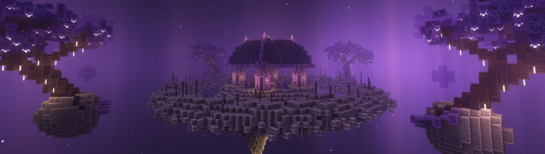
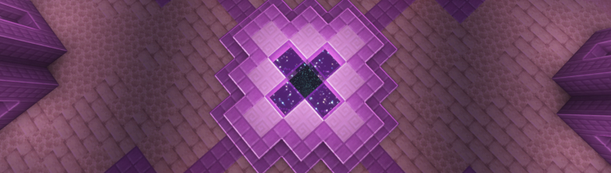

# 📕 El renacer

De esa oscuridad nació **un nuevo universo**, diferente a todo lo anterior.\
Aquí, las criaturas podían ser **capturadas, entrenadas y enfrentadas** en duelos uno a uno.

lorspi volvió a encontrarse con viejos conocidos y con otros seres nuevos.\
Pero LaPetitxd llegó tarde…\
Y esta vez, **sin memoria**.

Recordaba fragmentos: su padre, algunos amigos, lugares vagos.\
Pero no recordaba a lorspi.\
Él, con paciencia y esperanza, comenzó a reunir los recuerdos perdidos, reconstruyendo su historia juntos hasta que, poco a poco, ella volvió a recordarlo.

Fue entonces cuando lorspi se obsesionó con el estudio de **El Vacío**.\
Descubrió una estructura antigua y colosal llamada **El Nexo**, que parecía cumplir la misma función del primer portal construido por LaPetitxd: conectar los universos a través del vacío mismo.

Con el tiempo comprendió un patrón.\
Cada universo tenía un ciclo: **nacimiento, expansión y ocaso**.\
Y cuando llegaba el ocaso, las almas eran absorbidas nuevamente por el vacío para renacer en otra forma.

En el centro del templo no había un portal como los demás, sino **un pequeño hueco en el suelo**, profundo e insondable, del cual emanaba una brisa helada.\
Al asomarse, **solo se veía oscuridad infinita**.\
lorspi comprendió que ese vacío no era una metáfora: **era el Vacío mismo**, el límite entre universos.

Entonces lo entendió todo.\
Para volver a encontrarse todos en el siguiente mundo, **debían saltar juntos a ese abismo**, sincronizados en tiempo y espacio.

<figure><figcaption></figcaption></figure>

Y así lo hicieron.\
Uno a uno, los viajeros se reunieron dentro del templo y rompieron la obsidiana que bloqueaba el portal.\
Tomados de la mano, miraron por última vez el resplandor de su mundo…\
Y **saltaron**.

<figure><figcaption></figcaption></figure>

El eco de sus pasos se perdió en la oscuridad.\
El templo quedó vacío.\
Y el ciclo se reinició una vez más.


