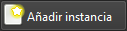
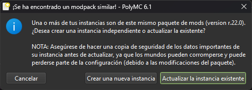

# 🆘 Backup of Ayuda

### ¿Cómo ocultar contraseña en stream?

El modpack incluye un mod de macros al que le puedes asignar comandos. Para evitar que tu `/login` se vea en stream configura un macro para ejecutar el comando de la siguiente forma:

1. Busca en la configuración de controles esta configuración y asígnale una tecla.

2. Con esa tecla asignada abres la configuración de macros. En esta pantalla dale al botón "Add Macro"

3. Luego despliega el macro que acabas de crear y pone tu comando `/login <contraseña>`, asígnale una tecla y dale "Save & Exit"

4. Cuando entres al servidor solo presionas la tecla asignada al macro y este comando se ejecutará en silencio. Si ya expusiste tu contraseña, usa el comando `/changepass <antigua contraseña> <nueva contraseña>` para cambiarla.

### Actualizar modpack



<figure><figcaption></figcaption></figure>


Antes de actualizar recuerda respaldar los siguientes archivos de la carpeta `.minecraft` de la instancia:

* `options.txt`: Guarda todas las configuraciones del juego incluyendo las asignaciones de teclas.
* Carpeta `config/`: Guarda las configuraciones específicas de cada mod.
* Carpetas `XaeroWaypoints` y `XaeroWorldMap`: Guardan toda la exploración que has hecho en el mapa y tus waypoints.




### En la ventana principal dale en "Añadir instancia"




### Dale a la opción "CurseForge", busca "Tulacraft" y dale "OK"

.png>)



### Actualizar instancia existente

El detectar que ya existe una instancia del modpack te va a preguntar lo siguiente a lo cual debes darle a la opción "Actualizar la instancia existente" y espera a que se termine de actualizar.

<figure><figcaption></figcaption></figure>



### Recupera tus configuraciones

Pega nuevamente en la carpeta `.minecraft` de la instancia las configuraciones que respaldaste.





<figure><figcaption></figcaption></figure>


Antes de actualizar recuerda respaldar los siguientes archivos de la carpeta `.minecraft` de la instancia:

* `options.txt`: Guarda todas las configuraciones del juego incluyendo las asignaciones de teclas.
* Carpeta `config/`: Guarda las configuraciones específicas de cada mod.
* Carpetas `XaeroWaypoints` y `XaeroWorldMap`: Guardan toda la exploración que has hecho en el mapa y tus waypoints.


La actualización se hace de forma automática en el launcher. Si por algún motivo esto falla, verifica que la versión del modpack que tienes es la última disponible de la siguiente forma:



### Busca actualizaciones

Entra en la instancia y dale al botón "Update pack" en la parte superior derecha de la lista de mods. Si no existe este boton, dale en "Refresh" para verificar actualizaciones.

<figure><figcaption></figcaption></figure>




### Selecciona la release más reciente

Dale clic en el icono verde de la release más reciente que te aparezca en la lista.

<figure><figcaption></figcaption></figure>



### Espera

Espera a que se termine de actualizar y listo.

<figure><figcaption></figcaption></figure>






